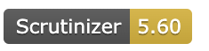
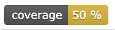
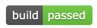

## Beskrivning
Detta är mitt rapportprojekt.

## Kom igång
För att köra den här webbplatsen lokalt, följ dessa steg:

1. Klona det här repot till din dator.
2. Öppna terminalen och navigera till katalogen "me/report".
3. Starta en lokal webbserver. Till exempel, om du har PHP installerat, kan du köra:
   ```bash
   php -S localhost:8000 -t public


## Scrutinizer

[](https://scrutinizer-ci.com/g/SaraHabanakeh/mvc2/)

[](https://scrutinizer-ci.com/g/SaraHabanakeh/mvc2/)

[](https://scrutinizer-ci.com/g/SaraHabanakeh/mvc2/)
